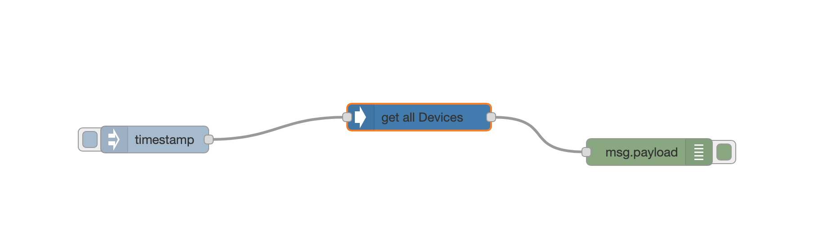

# node-red-contrib-netgear

Node-RED node collection for communication with Netgear routers using SOAP.

It is based on the module from grujiter: https://github.com/gruijter/netgear.js/ and wraps Node modules around them.

**PLEASE NOTE: It can take up to 10 seconds if the result will be available. This seems a limitation of the SOAP interface, not from Node-RED.**

## Installation

TBD

## Quickstart

Just create a simple flow:
1. Add a get all devices node, an inject node and a debug node.
2. connect them as shown in the picture:

3. create a new config node and enter your admin password and the ip of your netgear router
4. deploy and inject.

--> after ~10 seconds you should see an array of objects in the debug windoe.

## List of functions

* get all devices - fetch a list of all attached devices and return an array.

## Credits

Written by Lyn Matten (C) 2020.

Published under MIT Licence

